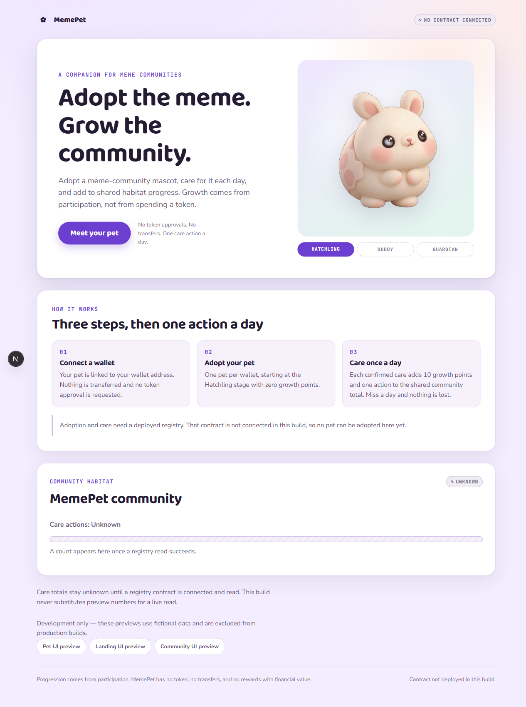
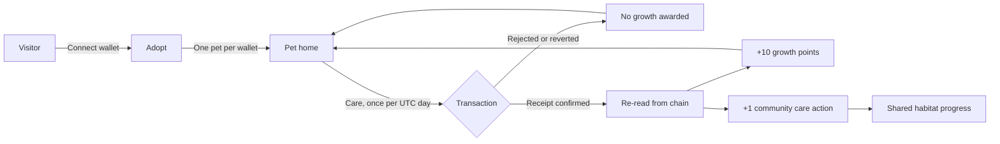

<div align="center">

# 🐣 MemePet

**Adopt the meme. Grow the community.**

A meme-community companion pet on **X Layer**. Adopt a wallet-linked mascot,
care for it once a day, and watch a shared community habitat grow.
Progression is earned by showing up — not by spending.

[](https://github.com/Chi944/memepet/actions/workflows/checks.yml)
[](https://www.okx.com/en-sg/learn/okx-dev-day-builder-kit)
[](https://web3.okx.com/onchainos/dev-docs/xlayer)
[](https://nextjs.org)
[](https://soliditylang.org)



</div>

---

## 📋 Submission at a glance

| | |
|---|---|
| **Event** | OKX Dev Day 2026 |
| **Track** | Build a Market — meme applications |
| **Team** | 3 people: lead (integration + contract), Teammate A (pet experience), Teammate B (community UI, QA, demo) |
| **Live demo** | ⏳ *Not deployed yet — see [Honest status](#-honest-status)* |
| **Demo video** | ⏳ *Not recorded yet* |
| **Contract** | ⏳ *Not deployed to X Layer yet. No address is invented anywhere in this repo.* |
| **Repository** | [github.com/Chi944/memepet](https://github.com/Chi944/memepet) |

> We would rather show you an empty box than a fake one. Every placeholder above
> is a real gap, not a formatting artefact. See [Honest status](#-honest-status).

---

## 📖 Table of contents

- [The problem](#-the-problem)
- [What MemePet does](#-what-memepet-does)
- [Honest status](#-honest-status)
- [How it works](#️-how-it-works)
- [Architecture](#️-architecture)
- [Deployed contracts](#-deployed-contracts)
- [Getting started](#-getting-started)
- [Running the checks](#-running-the-checks)
- [Project structure](#-project-structure)
- [What we deliberately did not build](#-what-we-deliberately-did-not-build)
- [Known limitations](#-known-limitations)
- [Roadmap](#-roadmap)
- [Team and credits](#-team-and-credits)

---

## 🧐 The problem

Meme communities are enormous and almost entirely transactional. The only way to
"belong" is to buy, hold, and watch a chart. That has three consequences:

1. **Participation costs money.** If you cannot afford the token, you cannot join in.
2. **Nothing accumulates.** Being active in a community for six months leaves no trace.
3. **Engagement apps become casinos.** The usual fix — rewards, staking, yield —
   turns a community into a financial product and attracts people who do not care
   about the community at all.

There is no lightweight, non-financial way to *show up* for a meme community and
have that showing-up mean something.

## 💡 What MemePet does

MemePet gives a community one shared mascot and gives every wallet its own pet.

- **Adopt** a pet, linked to your wallet. One per wallet. Costs nothing but gas.
- **Care** for it once per UTC day. One transaction, no approvals, no transfers.
- **Grow** — each confirmed care adds 10 growth points. Your pet evolves through
  three stages: Hatchling → Buddy → Guardian.
- **Contribute** — every care also increments a shared community counter, so the
  habitat grows from collective participation.

Nothing is bought, sold, staked or swapped. There is **no MemePet token**. The
scarcest thing in the system is attention, and that is the point.

---

## 🚦 Honest status

This is a hackathon project mid-build, and the README reflects the repository
rather than the pitch. Anything not finished says so.

| Capability | State |
|---|---|
| Landing, how-it-works, community panel | ✅ On `main` |
| Pet scene, three stage assets, care-state panel | ✅ On `main` |
| Design system, dark mode, mobile (390px) | ✅ On `main` |
| `PetRegistry` contract + 13 unit tests | ✅ On `main` |
| Wallet connect → adopt → read back → survive refresh | ✅ On `main`, verified on local Anvil |
| Daily care transaction + live community read | 🔨 In review, not yet merged |
| Deployed to X Layer testnet | ❌ Not yet |
| Public live link | ❌ Not yet |
| Demo video | ❌ Not yet |

**A design principle you can check in the code:** the UI never shows a number it
cannot justify.

- `null` means **unknown**, and unknown renders as a hatched, explicitly-unknown
  bar — never as an empty bar that reads as zero.
- A confirmed `0` renders as `0`, which is a different thing.
- Every data surface carries a provenance chip: `Live`, `Preview data`, or `Unknown`.
- Development fixtures are **never** used as a fallback when a live read fails.
  A failed read is an error state.
- Growth is displayed only after a transaction receipt confirms success *and* the
  pet is re-read from the chain. A transaction hash is not success.

---

## ⚙️ How it works



### The rules, enforced on chain

| Rule | Where |
|---|---|
| One pet per wallet | `adopt()` reverts with `AlreadyAdopted` |
| Only the approved community | `adopt()` reverts with `InvalidCommunity` |
| Cannot care without a pet | `care()` reverts with `NoPet` |
| One care per UTC calendar day | `care()` reverts with `AlreadyCaredToday` |
| 10 growth points per confirmed care | Derived in the UI, never stored on chain |
| Buddy at 20 points, Guardian at 50 | Derived in the UI |
| Missing a day costs nothing | No penalty logic exists |

Growth points and stage are **derived** from `careCount` rather than stored, so
there is no second source of truth to drift.

The daily rule uses `block.timestamp / 1 days`, so the boundary is UTC midnight.
Four dedicated tests pin that boundary: first care at exact midnight, a duplicate
at the last second of the same day, a care one second into the next day, and a
care after skipping 30 days.

---

## 🏗️ Architecture

A strict boundary runs through the app: **presentational components receive
display values and callbacks. They never fetch, never sign, and never award
progress.**

```
┌─────────────────────────────────────────────────────────┐
│  Presentation  src/components/**                        │
│  PetScene · CarePanel · LandingHero · CommunityPanel     │
│  props in, callbacks out. No wallet imports. No fetching.│
└──────────────────────────▲──────────────────────────────┘
                           │  view models + onCare/onConnect
┌──────────────────────────┴──────────────────────────────┐
│  Integration  src/hooks/** · src/lib/**                  │
│  useWallet · usePetRegistry · care-action-machine        │
│  map-pet · pet-progress · chains · deployment            │
└──────────────────────────▲──────────────────────────────┘
                           │  viem
┌──────────────────────────┴──────────────────────────────┐
│  Chain  contracts/src/PetRegistry.sol                    │
│  adopt() · care() · petOf() · communityStats()           │
└─────────────────────────────────────────────────────────┘
```

`src/lib/deployment.ts` is the **single source of truth** for what is deployed.
It ships as `status: "not-deployed"` with every field `null`, and is overridden
only by validated `NEXT_PUBLIC_MEMEPET_*` environment variables. There is no
placeholder address anywhere in the repository — by design, so that a fake
address can never reach a demo.

### Built with

| Layer | Choice | Why |
|---|---|---|
| Framework | [Next.js 16.3.5](https://nextjs.org) App Router, React 19, TypeScript | Static landing, server components, one deploy target |
| Styling | CSS Modules + custom properties | No UI framework; full control of the design system, zero runtime cost |
| Chain access | [viem](https://viem.sh) + injected EIP-1193 provider | Smallest workable surface — one dependency, no wallet-UI framework |
| Contract | [Foundry](https://getfoundry.sh), Solidity 0.8.24 | Fast tests, good time-travel for the UTC-day rule |
| Testing | [Vitest](https://vitest.dev) + Testing Library, `forge test` | 29 app tests, 13 contract tests |
| CI | GitHub Actions | Both suites plus a production preview-gate assertion on every PR |

**Total runtime dependencies: 4** — `next`, `react`, `react-dom`, `viem`.

---

## 🔗 Deployed contracts

| Network | Chain ID | Address | Explorer |
|---|---|---|---|
| X Layer testnet | 1952 | ⏳ *not deployed* | — |
| X Layer mainnet | 196 | *not planned for this submission* | — |

Network parameters are taken from the
[official X Layer network information](https://web3.okx.com/onchainos/dev-docs/xlayer/developer/build-on-xlayer/network-information)
and live in [`src/lib/chains.ts`](src/lib/chains.ts).

Local verification uses Anvil (chain `31337`). An Anvil address is a local
artefact and is never committed — it goes in a gitignored `.env.local`.

---

## 🚀 Getting started

### Prerequisites

- **Node 24.19.x** (pinned in `.nvmrc`) and **npm 11.19.x**
- [Foundry](https://getfoundry.sh) — only needed for contract work
- A browser wallet (MetaMask or OKX Wallet) — only needed for the live flow

### Install and run

```bash
git clone https://github.com/Chi944/memepet.git
cd memepet
npm ci
npm run dev
```

Open <http://localhost:3000>. No wallet, RPC endpoint, API key or backend is
required to browse the app or any preview.

### Pages

| Route | What it is |
|---|---|
| `/` | Landing, how-it-works, and the community habitat panel |
| `/pet` | Pet home. Shows an honest gate when no registry is configured |
| `/dev/pet` | Pet UI across all stages and care states — fictional data |
| `/dev/landing` | Landing hero — fictional data |
| `/dev/community` | Community panel across loading / zero / growing / achieved / unavailable / unknown-target |

The `/dev/*` routes exist so the UI can be built and reviewed without a wallet.
They are **excluded from production builds** — the layout calls `notFound()`
before rendering, and CI asserts all three return HTTP 404 in a production
server on every pull request.

### Trying the on-chain flow locally

```bash
# terminal 1
anvil

# terminal 2
forge create --root contracts src/PetRegistry.sol:PetRegistry \
  --rpc-url http://127.0.0.1:8545 --broadcast --unlocked \
  --from <an anvil account>

cp .env.example .env.local   # set the deployed address, then restart npm run dev
```

### Public hosting (Vercel)

The app can be hosted with `DEPLOYMENT.status` still `"not-deployed"` so the
submission has a live link before the contract address exists. See
[`docs/deploy/VERCEL.md`](docs/deploy/VERCEL.md). X Layer testnet contract
steps (simulate / human broadcast / record): [`docs/deploy/XLAYER_TESTNET.md`](docs/deploy/XLAYER_TESTNET.md).

---

## ✅ Running the checks

```bash
npm run typecheck        # tsc --noEmit
npm run lint             # eslint
npm test                 # vitest run  — 29 tests
npm run build            # next build
npm run test:contracts   # forge test  — 13 tests
```

CI runs all of these on every pull request, plus a production-server check
asserting `/` is 200 and each `/dev/*` route is 404.

---

## 📁 Project structure

```
contracts/
  src/PetRegistry.sol        Wallet-linked, non-transferable pet registry
  test/PetRegistry.t.sol     13 tests, including UTC-day boundary cases
src/
  app/                       Routes, layout, global styles, dev previews
  components/
    pet/                     PetScene, CarePanel        (Teammate A)
    landing/                 LandingHero, HowItWorks    (Teammate B)
    community/               CommunityPanel             (Teammate B)
    ui/                      Button, Card, Badge, AppShell (lead)
  hooks/                     useWallet, usePetRegistry
  lib/                       deployment, chains, mapping, progression rules
  types/view-models.ts       The frozen UI contract between layers
  fixtures/                  Fictional data — previews and tests only
docs/
  PROJECT_BRIEF.md           Frozen scope
  OWNERSHIP.md               File ownership and integration contract
  DEV_SETUP.md               Verified commands and actual results
  AUDIT_2026-09-20.md        Audit findings, fixed and open
  STATUS.md                  Current state and per-person next steps
```

---

## 🚫 What we deliberately did not build

Scope discipline was a design decision, recorded in
[`docs/PROJECT_BRIEF.md`](docs/PROJECT_BRIEF.md) before implementation started:

**No** new token · **no** marketplace · **no** launchpad · **no** staking or
yield · **no** breeding or trading · **no** NFT · **no** token approvals or
transfers · **no** rewards with financial value · **no** chatbot · **no**
real-time 3D engine · **no** in-app social feed.

We also kept it to **one community and one mascot with three stages**. A second
mascot would have added nothing a judge scores and would have meant changing and
redeploying the contract during the final days.

---

## ⚠️ Known limitations

Recorded honestly; the full list lives in
[`docs/AUDIT_2026-09-20.md`](docs/AUDIT_2026-09-20.md).

- **Not yet deployed to X Layer.** Everything on-chain has been verified against
  a local Anvil node, which proves the logic but says nothing about real network
  behaviour, gas, or how a wallet surfaces a revert.
- **The care loop is not merged to `main` yet** at the time of writing.
- `communityStats()` reverts for an unapproved community id. The read layer must
  map that revert to *unknown*, never to `0`.
- Browser-level wallet states — rejecting a signature in MetaMask, switching
  accounts mid-session — are handled in code but have not been exercised by hand.
- The mascot art was produced by knocking a black studio background out to alpha,
  so some edge fringing may remain. See [`docs/pet-assets.md`](docs/pet-assets.md).
- No third-party licence was purchased for the artwork; treat it as
  team-generated hackathon material.

## 🔭 Roadmap

Immediate, before submission: deploy to X Layer testnet, merge the care loop,
publish a live link, record the demo, and run manual QA against the deployed app.

Beyond the hackathon: multiple communities, accessory saving, public pet profile
pages, and a read-only holder indicator. All are listed as stretch scope in the
brief and none are started.

---

## 👥 Team and credits

Three contributors with clear ownership boundaries, documented in
[`docs/OWNERSHIP.md`](docs/OWNERSHIP.md):

| Role | Owns |
|---|---|
| **Lead** | Contract, wallet and data integration, routes, shared UI, types, CI, deployment |
| **Teammate A** | Pet presentation and stage artwork |
| **Teammate B** | Landing and community UI, manual QA, demo materials |

Built with open-source tooling: [Next.js](https://nextjs.org),
[React](https://react.dev), [viem](https://viem.sh),
[Foundry](https://getfoundry.sh), [Vitest](https://vitest.dev),
[Testing Library](https://testing-library.com). Fonts are
[Baloo 2](https://fonts.google.com/specimen/Baloo+2),
[Nunito Sans](https://fonts.google.com/specimen/Nunito+Sans) and
[JetBrains Mono](https://fonts.google.com/specimen/JetBrains+Mono), served via
`next/font`.

AI coding tools were used during development. Every check result reported in this
repository was actually executed, and anything unverified is labelled as such.
