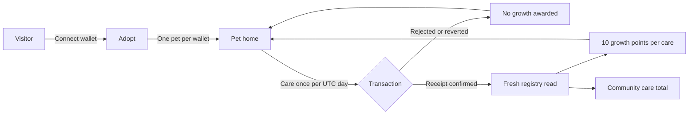

<div align="center">

# 🐣 MemePet

**Adopt the meme. Grow the community.**

A meme-community companion on **X Layer testnet**. Adopt a wallet-linked mascot,
care for it once a day, and contribute to a shared community ritual.
Growth comes from confirmed care. No MemePet token to buy; network gas applies.

[](https://github.com/Chi944/memepet/actions/workflows/checks.yml)
[](https://www.okx.com/en-sg/learn/okx-dev-day-builder-kit)
[](https://web3.okx.com/onchainos/dev-docs/xlayer)
[](https://nextjs.org)
[](https://soliditylang.org)

[Live app](https://memepet.vercel.app) · [Demo script](docs/demo/DEMO_SCRIPT.md) · [Submission notes](docs/demo/SUBMISSION_NOTES.md)


<sub>Public homepage captured 23 September 2026 (Singapore). The mascot showcase is stage artwork, not an earned wallet state.</sub>

</div>

---

## 📋 Submission at a glance

| | |
|---|---|
| **Event** | OKX Dev Day 2026 |
| **Intended track** | Build a Market — meme application; precise track fit and testnet eligibility **UNVERIFIED** |
| **Team** | Deston (lead), Kym (pet experience), Larm (community UI, QA and demo); exact form roster remains unverified |
| **Live demo** | [memepet.vercel.app](https://memepet.vercel.app) |
| **Demo video** | ⏳ **UNVERIFIED — VIDEO_URL**; script ready, recordings and final edit outstanding |
| **Contract** | [`0xe844152262D243a7B90F6e07FF7A67F1d7FeD216`](https://www.okx.com/web3/explorer/xlayer-test/address/0xe844152262D243a7B90F6e07FF7A67F1d7FeD216) |
| **Network** | X Layer testnet · chain **1952** · gas currency **OKB** |
| **Repository** | [github.com/Chi944/memepet](https://github.com/Chi944/memepet) |

The core implementation is merged. The remaining work is real wallet verification,
final release QA and the submission package. Current evidence is summarized below;
all unverified fields remain visible in the [submission notes](docs/demo/SUBMISSION_NOTES.md).

---

## 📖 Table of contents

- [The problem](#the-problem)
- [What MemePet does](#what-memepet-does)
- [Honest status](#honest-status)
- [How it works](#how-it-works)
- [Architecture](#architecture)
- [Deployed contracts](#deployed-contracts)
- [Getting started](#getting-started)
- [Running the checks](#running-the-checks)
- [Project structure](#project-structure)
- [Product scope](#product-scope)
- [Known limitations](#known-limitations)
- [Roadmap and recording pack](#roadmap)
- [Team and credits](#team-and-credits)

---

<a id="the-problem"></a>
## 🧐 The problem

For a meme community, a price chart tells only part of the story. MemePet explores
another reason to return: a small companion that grows through a daily act of care.
The goal is to make participation visible and give the community a shared ritual.

This is a product hypothesis. We have not yet established organic adoption,
retention or demand through community testing.

<a id="what-memepet-does"></a>
## 💡 What MemePet does

- **Adopt** a pet linked to your wallet. One pet per wallet; network gas applies.
- **Care** once per UTC calendar day through an explicit wallet transaction.
- **Grow** by ten points per confirmed care: Hatchling → Buddy → Guardian.
- **Contribute** one care action to the community total with every confirmed care.
- **Share** a read-only public pet page with a generated stage-aware share image.

Missing a day never removes earned growth. The prototype has no MemePet token,
marketplace, staking or financial rewards. Adoption and care do not request token
allowances or token transfers; wallet approval and network gas are still required.

| Hatchling · 0 points | Buddy · 20 points | Guardian · 50 points |
|:---:|:---:|:---:|
|  |  |  |

*Stage illustrations show the product's designs. They do not establish a recorded live evolution.*

---

<a id="honest-status"></a>
## 🚦 Honest status

Updated **23 September 2026 (Singapore)**. Implementation and verified browser
results are listed separately.

| Capability | Current state |
|---|---|
| Landing, how-it-works and community panel | ✅ Merged |
| Pet scene, three stages and care-state panel | ✅ Merged, including corrected artwork and evolution presentation |
| Black/lime design, responsive layouts and reduced-motion styles | ✅ Implemented; final visual QA after the latest artwork changes remains open |
| Wallet connection, network switch and account-access revocation | ✅ Implemented; hosted connection observed, real Disconnect and reload verified |
| Adoption, care, receipts and confirmed read-back | ✅ Implemented; complete browser-wallet journey **UNVERIFIED** |
| Public pet page and generated share images | ✅ Merged; adopted-pet browser consistency still needs evidence |
| X Layer testnet deployment | ✅ Deployed; executable runtime comparison documented |
| Automated checks | ✅ **111 app tests / 20 files**, **15 contract tests**, typecheck, lint, build and production route checks passed on recording-kit revision `9a2bdab` |
| Three-person recording scripts | ✅ Three turns and **130 selected words each**; planned runtime **3:25** |
| Final demo video and submission | ⏳ Three MP3s, genuine transaction footage, editing and remaining form answers outstanding |

[CI run for `9a2bdab`](https://github.com/Chi944/memepet/actions/runs/35787304045)
records the automated results. Lint passed with one existing image-element warning.
The [release audit](docs/qa/evidence/RELEASE_AUDIT_2026-09-23.md) records the real
hosted disconnect and reload. No browser adoption, care or rejection is being
claimed as passing. A read-only homepage capture does not change that status.

**Confirmed data drives the interface:**

- Unknown values stay explicitly unknown; a confirmed zero is displayed as zero.
- Data badges distinguish live reads, fictional previews and unavailable values.
- Development fixtures never replace failed live reads.
- Growth requires a successful receipt and a fresh registry read.
- The community total counts **care actions**, not people, adopted pets or wallets.

---

<a id="how-it-works"></a>
## ⚙️ How it works



### Contract rules and UI mapping

| Rule | Where it is enforced |
|---|---|
| One pet per wallet | `adopt()` reverts with `AlreadyAdopted` |
| Approved community only | `adopt()` reverts with `InvalidCommunity` |
| A pet is required for care | `care()` reverts with `NoPet` |
| One care per UTC calendar day | `care()` reverts with `AlreadyCaredToday` |
| Ten growth points per care | Derived from confirmed `careCount` in the app |
| Buddy at 20; Guardian at 50 | Derived in the app |
| No missed-day penalty | The contract does not remove care history |

The daily boundary uses `block.timestamp / 1 days`: **UTC midnight**, or
**08:00 Singapore time**. Growth and stage are derived from the same confirmed
care count; they are not a separate saved balance.

---

<a id="architecture"></a>
## 🏗️ Architecture

Presentation receives display values and callbacks. Wallet access, reads and
transaction state live in the integration layer.

```text
┌──────────────────────────────────────────────────────────┐
│ Presentation · src/components/**                         │
│ PetScene · CarePanel · LandingHero · CommunityPanel       │
│ View models in; action callbacks out                     │
└──────────────────────────▲───────────────────────────────┘
                           │
┌──────────────────────────┴───────────────────────────────┐
│ Integration · src/hooks/** · src/lib/**                  │
│ useWallet · usePetRegistry · care-action-machine          │
│ map-pet · pet-progress · deployment · share-image mapping │
└──────────────────────────▲───────────────────────────────┘
                           │ viem
┌──────────────────────────┴───────────────────────────────┐
│ Chain · contracts/src/PetRegistry.sol                    │
│ adopt() · care() · petOf() · communityStats()             │
└──────────────────────────────────────────────────────────┘
```

[`src/lib/deployment.ts`](src/lib/deployment.ts) records the declared deployment.
Validated public environment overrides support local Anvil work. Signing
credentials never belong in client configuration.

### Built with

| Layer | Choice | Purpose |
|---|---|---|
| Framework | Next.js 16.3.5, React 19, TypeScript | Routes, rendering and server-generated share images |
| Styling | CSS Modules, custom properties, Geist / Geist Mono | Consistent black/lime interface and motion |
| Chain access | viem + an injected EIP-1193 wallet | Explicit reads and adoption/care requests |
| Contract | Solidity 0.8.24 / Foundry | Registry and UTC-day rules |
| Testing | Vitest, Testing Library, Foundry | Application and contract regression checks |
| CI | GitHub Actions | Typecheck, lint, tests, build and production preview gates |

Four runtime dependencies: `next`, `react`, `react-dom`, `viem`.

---

<a id="deployed-contracts"></a>
## 🔗 Deployed contracts

| Network | Chain ID | Registry |
|---|---|---|
| X Layer testnet | 1952 | [`0xe844152262D243a7B90F6e07FF7A67F1d7FeD216`](https://www.okx.com/web3/explorer/xlayer-test/address/0xe844152262D243a7B90F6e07FF7A67F1d7FeD216) |

[Deployment transaction](https://www.okx.com/web3/explorer/xlayer-test/tx/0x2ff191a789d48bc58f19e018dfee82aad4cba2ad50212d942e8e1e002fd593f9)
· block **41,543,244**. No mainnet deployment is claimed.

The executable runtime matches the deployed contract; compiler metadata differs
after the SPDX comment change. Bytecode comparison does not establish explorer
source verification or an independent security audit. See
[deployment evidence](docs/deploy/XLAYER_TESTNET.md).

---

<a id="getting-started"></a>
## 🚀 Getting started

### Prerequisites

- **Node 24.19.x** (`.nvmrc`) and **npm 11.19.x**.
- **Foundry** for contract tests or a local chain.
- A browser wallet and testnet gas for the live transaction flow.

### Install and run

```bash
git clone https://github.com/Chi944/memepet.git
cd memepet
npm ci
npm run dev
```

Open [localhost:3000](http://localhost:3000). Browsing needs no wallet. The committed
configuration reads the public X Layer testnet registry, so live data needs
network access. Production builds also download Google Fonts.

### Pages

| Route | Purpose |
|---|---|
| `/` | Overview, stage artwork and community progress |
| `/pet` | Connect, adopt, care and view the connected wallet's pet |
| `/pet/<wallet-address>` | Read-only public pet page and generated share image |
| `/dev/pet` | Fictional pet stages and care-state previews |
| `/dev/landing` | Fictional landing preview |
| `/dev/community` | Loading, zero, growing, unavailable and other community previews |

The `/dev/*` routes return **404 in production**. CI checks that gate.
For local Anvil setup, use [development setup](docs/DEV_SETUP.md) and
[`.env.example`](.env.example); keep private overrides in gitignored `.env.local`.

### Public hosting

The app runs on [Vercel](https://memepet.vercel.app). Configuration and deployment
procedures are documented in [Vercel setup](docs/deploy/VERCEL.md) and
[X Layer deployment](docs/deploy/XLAYER_TESTNET.md).

---

<a id="running-the-checks"></a>
## ✅ Running the checks

```bash
npm run typecheck
npm run lint
npm test
npm run build
```

Install Foundry and its test library before running contract checks:

```bash
cd contracts
forge install foundry-rs/forge-std --no-git
cd ..
npm run test:contracts
```

CI runs these checks and starts the production build to assert `/` returns 200
and the three `/dev/*` pages return 404. Automated passes are separate from the
[real browser-wallet walkthrough](docs/qa/BROWSER_WALKTHROUGH.md).

---

<a id="project-structure"></a>
## 📁 Project structure

```text
contracts/
  src/PetRegistry.sol       Wallet-linked pet registry
  test/PetRegistry.t.sol    Contract and UTC-day tests
src/
  app/                     Routes, public pet/share images, layout, previews
  components/
    pet/                   PetScene, CarePanel
    landing/               LandingHero, HowItWorks
    community/             CommunityPanel
    ui/                    Button, Card, Badge, AppShell
  hooks/                   useWallet, usePetRegistry
  lib/                     Deployment, reads, mappings, progression, share art
  types/view-models.ts      UI contract between layers
  fixtures/                Fictional preview/test data only
public/pets/               Stage artwork and share backgrounds
docs/
  PROJECT_BRIEF.md          Scope and core user story
  OWNERSHIP.md              Integration responsibilities
  STATUS.md                 Current next steps and dated history
  demo/                    Scripts, production plan and submission notes
  qa/                      Walkthroughs and dated evidence
```

Raw recordings, exports and media caches are ignored under `media/`. Production
instructions and reusable source composition belong in tracked files.

---

<a id="product-scope"></a>
## 🎯 Product scope

The prototype supports **one community, one mascot and three stages**, with a
wallet-linked registry, daily care, public viewing and a shared care count.

A token economy, NFT trading, marketplace, staking, breeding and social feed are
outside the [agreed scope](docs/PROJECT_BRIEF.md). Multiple communities, accessories
and a read-only holder indicator remain optional future work.

<a id="known-limitations"></a>
## ⚠️ Known limitations

- **Testnet deployment.** Organizer acceptance of this precise track integration
  and testnet-only implementation remains unverified.
- **Browser transaction evidence is incomplete.** Rejection, adoption, care,
  cooldown, account switching and adopted-pet refresh still need a genuine run.
- **Final visual QA remains open.** Earlier checks predate the latest artwork
  and evolution merges; complete desktop/mobile, keyboard and reduced-motion checks.
- **Wallet warning follow-up.** The MetaMask review issue was closed, but a fresh
  warning-free connection prompt has not been verified. Follow the
  [wallet setup guidance](docs/qa/WALLET_SETUP.md); leave any warning unapproved.
- **No independent security audit.** The dated dependency audit found zero known
  vulnerabilities at that time; it cannot establish zero risk.
- **Rights and licensing.** The contract has an MIT SPDX identifier. The repository
  has no project-wide licence yet, and asset permissions still require confirmation.
  See [pet asset provenance](docs/pet-assets.md).

<a id="roadmap"></a>
## 🔭 Roadmap and recording pack

**The core feature prompts are implemented.** The immediate work is verification
and delivery; use [current task status](docs/STATUS.md) before running an older
prompt pack. A prompt's presence in the repository does not mean it is unfinished.

| Next step | Completion evidence |
|---|---|
| Real wallet walkthrough | Genuine rejection, adoption, care, receipt/read-back, cooldown, refresh and account-switch results |
| Final release QA | Current desktop/mobile, keyboard, reduced-motion and public/share-page checks |
| Three voice recordings | One MP3 each from Deston, Kym and Larm |
| Demo edit | Actual product footage, balanced voices, captions and a reviewed 2–4 minute export |
| Submission | Eligibility/rights and form answers confirmed; app/repo/video links checked; receipt retained |

The [combined script](docs/demo/DEMO_SCRIPT.md) gives everyone **three turns and
130 selected words**, targeting **3:25**. Individual read-aloud scripts:
[Deston](docs/demo/speakers/lead.md) · [Kym](docs/demo/speakers/teammate-a.md) ·
[Larm](docs/demo/speakers/teammate-b.md).

Use the [production plan](docs/demo/PRODUCTION_PLAN.md),
[recording checklist](docs/demo/RECORDING_CHECKLIST.md) and
[Codex editing handoff](docs/demo/EDITOR_HANDOFF.md). Actual speaking durations and
the final video remain pending. Later-day Buddy footage is optional: the script
includes an equal-length artwork/rules alternate. Core adoption/care footage is
still required.

[Team responsibilities](docs/demo/TEAM_READINESS.md) ·
[Submission fields](docs/demo/SUBMISSION_NOTES.md) ·
[Repository cleanup record](docs/demo/REPOSITORY_AUDIT.md)

---

<a id="team-and-credits"></a>
## 👥 Team and credits

| Contributor | Project contribution |
|---|---|
| **Deston — lead** | Contract, wallet/data integration, routes, shared UI, CI, deployment and release checks |
| **Kym — pet experience** | Pet presentation, stage artwork and evolution presentation |
| **Larm — community experience** | Landing/community UI, QA and demo materials |

Responsibilities are documented in [file ownership](docs/OWNERSHIP.md).
Built with [Next.js](https://nextjs.org), [React](https://react.dev),
[viem](https://viem.sh), [Foundry](https://getfoundry.sh),
[Vitest](https://vitest.dev) and [Testing Library](https://testing-library.com).
Fonts: **Geist and Geist Mono**, loaded through `next/font`.

AI coding tools were used during development. Dated evidence distinguishes
implementation, automated checks, browser observations and planned work.
