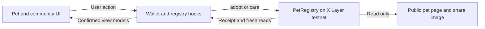

# MemePet

**A small companion. A reason to come back.**

MemePet is a meme-community companion on **X Layer testnet**. Adopt a wallet-linked pet, care for it once per UTC day, and contribute to a shared community care count. Its purpose is to make participation visible through a familiar daily ritual.

[Live app](https://memepet.vercel.app) · [Contract](https://www.okx.com/web3/explorer/xlayer-test/address/0xe844152262D243a7B90F6e07FF7A67F1d7FeD216) · [Submission notes](docs/demo/SUBMISSION_NOTES.md) · [Demo script](docs/demo/DEMO_SCRIPT.md)

[](https://github.com/Chi944/memepet/actions/workflows/checks.yml)

## For judges

| Item | Current position |
|---|---|
| Event | OKX Dev Day 2026 |
| Intended track | Build a Market — meme application; precise track fit and testnet acceptance remain **UNVERIFIED** |
| Product | One community, one wallet-linked pet per account, three growth stages and a shared care counter |
| Live application | [memepet.vercel.app](https://memepet.vercel.app) |
| Network | X Layer **testnet**, chain **1952**, gas currency **OKB** |
| Registry | `0xe844152262D243a7B90F6e07FF7A67F1d7FeD216` |
| Demo video | **UNVERIFIED — VIDEO_URL**. The final video has not been recorded or exported |
| Team | Deston — integration; Kym — pet experience; Larm — community experience and QA |

This is a working prototype with an incomplete browser transaction walkthrough. The deployed site and contract exist; successful browser adoption, care and persisted-pet refresh still need genuine wallet evidence. [Current evidence and open submission fields](docs/demo/SUBMISSION_NOTES.md).

## The experience

1. Connect a browser wallet and select X Layer testnet.
2. Adopt a pet linked to that wallet.
3. Care once per UTC calendar day. Each recorded care contributes **10 growth points** and **one community care action**.
4. Return to the same wallet to read the pet's saved state. Growth reaches **Buddy at 20 points** and **Guardian at 50**.

There is no missed-day penalty. The prototype has no MemePet token, token purchase, marketplace, staking or financial reward. Adoption and care still require network gas.

The three stage illustrations below are product artwork, **not evidence of an earned live evolution**.

| Hatchling · 0 points | Buddy · 20 points | Guardian · 50 points |
|:---:|:---:|:---:|
|  |  |  |

## What is verified

The [23 September release audit](docs/qa/evidence/RELEASE_AUDIT_2026-09-23.md) records the exact checks and limitations. Its results apply to that release, rather than automatically certifying every later change.

| Area | Evidence |
|---|---|
| Automated checks | **111 app tests** and **15 contract tests** passed; production build and TypeScript checks passed |
| Lint | Exit 0, with one existing image-element warning in the Open Graph renderer |
| Dependencies | `npm audit` reported **0 known vulnerabilities** at audit time; this is not an independent security audit |
| Deployment | X Layer testnet registry deployed; current executable runtime matches the deployed contract after excluding compiler metadata |
| Real browser wallet | Existing hosted connection on chain 1952 observed; Disconnect revoked account access and the disconnected state survived reload |
| Browser adoption, care and persistence | **UNVERIFIED**; automated tests and historical local-node transactions do not complete the real wallet walkthrough |
| Demo and submission | **INCOMPLETE**; final video, remaining form answers and eligibility confirmation are still required |

The UI reads confirmed chain state. It does not award growth merely because a button was pressed or a transaction hash was returned: a successful receipt and a fresh registry read are required. Unknown data stays unknown. Fictional development fixtures are never a fallback for failed live reads.

A community care count is **not** a count of adopted pets, users or wallets. We do not claim organic adoption or usage metrics.

## Architecture



- **Next.js / React / TypeScript:** routes, public pet pages and server-rendered share images.
- **CSS Modules:** original MemePet interface, stage artwork and motion with reduced-motion styles.
- **viem + an injected EIP-1193 wallet:** contract reads and explicit adoption/care requests.
- **Solidity / Foundry:** one pet per wallet, one approved community and one care per UTC day. Growth and stage are derived from `careCount` in the app.
- **Vitest / Testing Library / GitHub Actions:** application, contract and production preview-gate checks.

Presentation components receive values and callbacks. Contract and wallet logic lives in `src/hooks/` and `src/lib/`; the contract lives in [`contracts/src/PetRegistry.sol`](contracts/src/PetRegistry.sol). Deployment configuration is in [`src/lib/deployment.ts`](src/lib/deployment.ts).

## Run locally

Requires **Node 24.19.x** and **npm 11.19.x**. Foundry is needed only for contract tests and local chain work.

```bash
git clone https://github.com/Chi944/memepet.git
cd memepet
npm ci
npm run dev
```

Open [localhost:3000](http://localhost:3000). The committed configuration uses the public X Layer testnet registry. Browsing needs no wallet; live reads need network access. The wallet flow needs a browser wallet and testnet gas. Build-time Google Fonts downloads also require network access.

| Route | Purpose |
|---|---|
| `/` | Overview and community care total |
| `/pet` | Connect, adopt, care and view the connected wallet's pet |
| `/pet/<wallet-address>` | Read-only public pet page; missing pets and unavailable reads stay explicit |
| `/dev/pet`, `/dev/landing`, `/dev/community` | Fictional UI previews for development only; production requests return 404 |

For a separate local chain, follow [development setup](docs/DEV_SETUP.md) and the public placeholders in [`.env.example`](.env.example). Keep local overrides in the gitignored `.env.local`. Never put signing credentials in `NEXT_PUBLIC_*` variables or the repository.

### Checks

```bash
npm run lint
npm test
npm run build
npm run typecheck
```

Install Foundry and its test dependency before checking the contract:

```bash
cd contracts
forge install foundry-rs/forge-std --no-git
cd ..
npm run test:contracts
```

CI also starts the production build and checks that `/` returns 200 and every `/dev/*` preview returns 404. A test pass is distinct from a real browser wallet action.

## Submission and recording pack

The voiceover pack includes a [combined script](docs/demo/DEMO_SCRIPT.md) and individual scripts for [Deston](docs/demo/speakers/lead.md), [Kym](docs/demo/speakers/teammate-a.md) and [Larm](docs/demo/speakers/teammate-b.md). Each person has three turns and 130 selected spoken words, recorded into one MP3. The planned runtime is 3:25; actual duration and voice balance remain pending recordings.

The [production plan](docs/demo/PRODUCTION_PLAN.md), [recording checklist](docs/demo/RECORDING_CHECKLIST.md) and [editing handoff](docs/demo/EDITOR_HANDOFF.md) separate narration, visual treatment and genuine screen evidence. [Team readiness](docs/demo/TEAM_READINESS.md) assigns remaining work; the [repository audit](docs/demo/REPOSITORY_AUDIT.md) records the bounded cleanup and retained evidence.

Before submission, complete the [browser walkthrough](docs/qa/BROWSER_WALKTHROUGH.md), capture real transaction receipts and read-back states, supply the three voice recordings, edit and review the 2–4 minute video, and replace `VIDEO_URL` with its verified public link. Keep any unavailable evolution sequence out of the success narration. [Submission notes](docs/demo/SUBMISSION_NOTES.md) track the remaining organizer and team fields.

## Scope, safety and credits

This release supports one community and one mascot on **testnet**. It has not received an independent security audit. The prior MetaMask domain-warning review was closed by a reviewer; a fresh warning-free wallet prompt remains unverified. If a warning appears, leave the prompt unapproved and follow the [wallet setup guidance](docs/qa/WALLET_SETUP.md). Disconnecting account access does not revoke separate token allowances or cancel an already-open wallet prompt.

The contract has an MIT SPDX identifier, but the repository does not yet declare a project-wide licence. Artwork source and remaining rights checks are recorded in [pet asset provenance](docs/pet-assets.md); no blanket clearance or exclusive ownership is claimed. AI coding tools were used during development.

| Contributor | Project contribution |
|---|---|
| **Deston** | Contract, wallet and data integration, deployment, shared UI and release checks |
| **Kym** | Pet presentation, stage artwork and evolution presentation |
| **Larm** | Landing and community presentation, QA and demo materials |

Build and review context remains in [`docs/`](docs/): [project brief](docs/PROJECT_BRIEF.md), [file ownership](docs/OWNERSHIP.md), [development setup](docs/DEV_SETUP.md), [deployment evidence](docs/deploy/XLAYER_TESTNET.md) and [dated QA records](docs/qa/evidence/). Historical results retain their dates so they cannot be mistaken for a current transaction pass.
