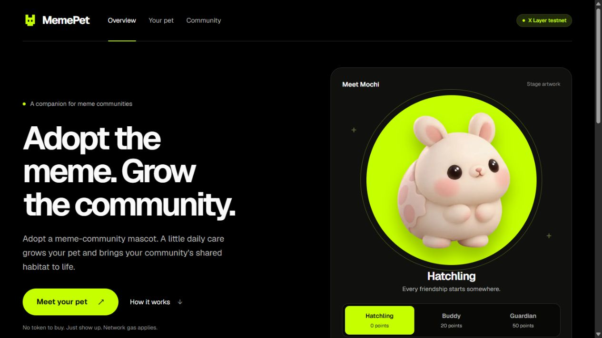
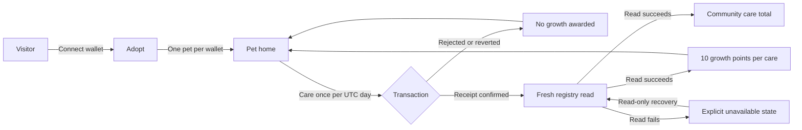

<div align="center">

# 🐣 MemePet

**Adopt the meme. Grow the community.**

A meme-community companion on **X Layer testnet**. Adopt a wallet-linked mascot,
care for it once a day, and contribute to a shared community ritual.
Growth comes from confirmed care. No MemePet token to buy; network gas applies.

[](https://github.com/Chi944/memepet/actions/workflows/checks.yml)
[](https://www.okx.com/en-sg/learn/okx-dev-day-builder-kit)
[](https://web3.okx.com/onchainos/dev-docs/xlayer/developer/build-on-xlayer/network-information)
[](https://nextjs.org)
[](https://soliditylang.org)

[Live app](https://memepet.vercel.app)



<sub>Public homepage captured 23 September 2026 (Singapore). The mascot showcase is stage artwork, not an earned wallet state.</sub>

</div>

---

## 📋 Submission at a glance

| | |
|---|---|
| **Event** | OKX Dev Day 2026 |
| **Intended track** | Build a Market — meme application; deployed on X Layer testnet |
| **Team** | **The four musketeers** — Deston, Kym, Larm and YeeWei |
| **Live demo** | [memepet.vercel.app](https://memepet.vercel.app) |
| **Demo video** | [Watch the 3:05 demo](https://youtu.be/ofPOony4nys) · uploaded; **currently Private, judge access pending** |
| **Contract** | [`0xe844152262D243a7B90F6e07FF7A67F1d7FeD216`](https://www.okx.com/web3/explorer/xlayer-test/address/0xe844152262D243a7B90F6e07FF7A67F1d7FeD216) |
| **Network** | X Layer testnet · chain **1952** · gas currency **OKB** |
| **Repository** | [github.com/Chi944/memepet](https://github.com/Chi944/memepet) |

### Review in 60 seconds — no wallet needed

1. Open the [live overview](https://memepet.vercel.app) to see Mochi's three stage designs and the shared care counter.
2. Visit the [verified demo pet](https://memepet.vercel.app/pet/0xb7E6D789c39D468CfE3c5dA37C29Bd9852247B3a). This public page reads the registry without a wallet connection; the checked run showed a live Hatchling with 10 growth points.
3. Inspect its [confirmed care transaction](https://www.okx.com/web3/explorer/xlayer-test/tx/0xa340d65b2e59276568c8ff364ea01ec4cf1cc995b6e0ce720ddd1477906e1a55) and [browser/receipt evidence](docs/qa/evidence/LATEST_RELEASE_QA_2026-09-24.md): one real care added ten points and exactly one community care.

To try adoption and care yourself, use the [wallet walkthrough](docs/qa/BROWSER_WALKTHROUGH.md) with an injected wallet and X Layer testnet gas. Browsing and public sharing require neither.

---

## 📖 Table of contents

- [The problem](#the-problem)
- [What MemePet does](#what-memepet-does)
- [Honest status](#honest-status)
- [How it works](#how-it-works)
- [Architecture](#architecture)
- [Deployed contracts](#deployed-contracts)
- [Getting started](#getting-started)
- [Running the checks](#running-the-checks)
- [Project structure](#project-structure)
- [Product scope](#product-scope)
- [Known limitations](#known-limitations)
- [Roadmap](#roadmap)
- [Team and credits](#team-and-credits)

---

<a id="the-problem"></a>
## 🧐 The problem

For a meme community, a price chart tells only part of the story. MemePet explores
another reason to return: a small companion that grows through a daily act of care.
The goal is to make participation visible and give the community a shared ritual.

This is a product hypothesis. We have not yet established organic adoption,
retention or demand through community testing.

<a id="what-memepet-does"></a>
## 💡 What MemePet does

- **Adopt** a pet linked to your wallet. One pet per wallet; network gas applies.
- **Care** once per UTC calendar day through an explicit wallet transaction.
- **Grow** by ten points per confirmed care: Hatchling → Buddy → Guardian.
- **Contribute** one care action to the community total with every confirmed care.
- **Share** a read-only public pet page with a generated stage-aware share image.

Missing a day never removes earned growth. The prototype has no MemePet token,
marketplace, staking or financial rewards. Adoption and care do not request token
allowances or token transfers; wallet approval and network gas are still required.

| Hatchling · 0 points | Buddy · 20 points | Guardian · 50 points |
|:---:|:---:|:---:|
|  |  |  |

*Stage illustrations show the product's designs. They do not establish a recorded live evolution.*

---

<a id="honest-status"></a>
## 🚦 Honest status

Verified **25 September 2026 (Singapore)**. Product runtime: `af886a75`;
later documentation-only releases retain the same application source.

| Area | Verified result |
|---|---|
| Wallet flow | Genuine rejection → adoption → care; automatic 10-point pet read-back, UTC cooldown and reload persistence |
| Read recovery | Automatic community refresh showed Unknown; **Retry community total** recovered the receipt-block total without a reload or second transaction |
| Sharing and disconnect | Public pet displayed correct live state without connecting; Disconnect revoked site access and persisted after reload |
| Interface | Four viewport layouts, keyboard navigation, reduced-motion preview and missing/unknown-state previews checked |
| Automated checks | **123 app tests / 21 files · 15 contract tests · 8 counter checks**; typecheck, lint, build and production preview gates passed |

[Release CI](https://github.com/Chi944/memepet/actions/runs/36040157500) and
[latest browser QA](docs/qa/evidence/LATEST_RELEASE_QA_2026-09-24.md) retain the
actual results, read failures and unrun checks. Lint has one existing image-element
warning and no errors. The 3:05 film passed technical QC; original care/refresh
result stills are labelled, and no live evolution or uninterrupted successful
care/refresh recording is claimed. [Capture evidence](docs/qa/evidence/FINAL_CAPTURE_2026-09-24.md)
records the exact footage boundaries.

**Confirmed data drives the interface.** Growth requires a successful receipt
and fresh registry read. Unknown totals stay unknown; fictional previews never
replace failed live reads. The shared total counts **care actions**, not users
or adopted pets.

---

<a id="how-it-works"></a>
## ⚙️ How it works



### Contract rules and UI mapping

| Rule | Where it is enforced |
|---|---|
| One pet per wallet | `adopt()` reverts with `AlreadyAdopted` |
| Approved community only | `adopt()` reverts with `InvalidCommunity` |
| A pet is required for care | `care()` reverts with `NoPet` |
| One care per UTC calendar day | `care()` reverts with `AlreadyCaredToday` |
| Ten growth points per care | Derived from confirmed `careCount` in the app |
| Buddy at 20; Guardian at 50 | Derived in the app |
| No missed-day penalty | The contract does not remove care history |

The daily boundary uses `block.timestamp / 1 days`: **UTC midnight**, or
**08:00 Singapore time**. Growth and stage are derived from the same confirmed
care count; they are not a separate saved balance.

---

<a id="architecture"></a>
## 🏗️ Architecture

| Layer | Responsibility |
|---|---|
| Presentation · `src/components/` | Pet, care and community views consume display values and callbacks |
| Integration · `src/hooks/`, `src/lib/` | Wallet sessions, explicit transactions, receipts, same-block reads and UI mapping |
| Registry · `contracts/src/PetRegistry.sol` | One pet per wallet, permitted community, UTC-day care limit and shared care count |

[`deployment.ts`](src/lib/deployment.ts) declares the public testnet configuration.
Signing credentials never belong in client configuration. Development fixtures
are isolated from live reads; preview routes return **404 in production**.

### Built with

| Layer | Choice | Purpose |
|---|---|---|
| Framework | Next.js 16.3.5, React 19, TypeScript | Routes, rendering and server-generated share images |
| Styling | CSS Modules, custom properties, Geist / Geist Mono | Consistent black/lime interface and motion |
| Chain access | viem + an injected EIP-1193 wallet | Explicit reads and adoption/care requests |
| Contract | Solidity 0.8.24 / Foundry | Registry and UTC-day rules |
| Testing | Vitest, Testing Library, Foundry | Application and contract regression checks |
| CI | GitHub Actions | Typecheck, lint, tests, build and production preview gates |

Four runtime dependencies: `next`, `react`, `react-dom`, `viem`.

---

<a id="deployed-contracts"></a>
## 🔗 Deployed contracts

| Network | Chain ID | Registry |
|---|---|---|
| X Layer testnet | 1952 | [`0xe844152262D243a7B90F6e07FF7A67F1d7FeD216`](https://www.okx.com/web3/explorer/xlayer-test/address/0xe844152262D243a7B90F6e07FF7A67F1d7FeD216) |

[Deployment transaction](https://www.okx.com/web3/explorer/xlayer-test/tx/0x2ff191a789d48bc58f19e018dfee82aad4cba2ad50212d942e8e1e002fd593f9)
· block **41,543,244**. No mainnet deployment is claimed.

The executable runtime was compared with the deployed contract; compiler metadata
differs after an SPDX comment change. [Deployment evidence](docs/deploy/XLAYER_TESTNET.md)
details the comparison; explorer source verification is not claimed.

---

<a id="getting-started"></a>
## 🚀 Getting started

### Prerequisites

- **Node 24.19.x** (`.nvmrc`) and **npm 11.19.x**.
- **Foundry** for contract tests or a local chain.
- A browser wallet and testnet gas for the live transaction flow.

### Install and run

```bash
git clone https://github.com/Chi944/memepet.git
cd memepet
npm ci
npm run dev
```

Open [localhost:3000](http://localhost:3000). Browsing needs no wallet. The committed
configuration reads the public X Layer testnet registry, so live data needs
network access. Production builds also download Google Fonts.

### Pages

| Route | Purpose |
|---|---|
| `/` | Overview, stage artwork and community progress |
| `/pet` | Connect, adopt, care and view the connected wallet's pet |
| `/pet/<wallet-address>` | Read-only public pet page and generated share image |
| `/dev/pet` | Fictional pet stages and care-state previews |
| `/dev/landing` | Fictional landing preview |
| `/dev/community` | Loading, zero, growing, unavailable and other community previews |

The `/dev/*` routes return **404 in production**. CI checks that gate.
For local Anvil setup, use [development setup](docs/DEV_SETUP.md) and
[`.env.example`](.env.example); keep private overrides in gitignored `.env.local`.

### Public hosting

The app runs on [Vercel](https://memepet.vercel.app). Configuration and deployment
procedures are documented in [Vercel setup](docs/deploy/VERCEL.md) and
[X Layer deployment](docs/deploy/XLAYER_TESTNET.md).

---

<a id="running-the-checks"></a>
## ✅ Running the checks

```bash
npm run typecheck
npm run lint
npm test
npm run build
node --test docs/qa/counter-check.regression.mjs
```

Install Foundry and its test library before running contract checks:

```bash
cd contracts
forge install foundry-rs/forge-std --no-git
cd ..
npm run test:contracts
```

CI runs these checks and starts the production build to assert `/` returns 200
and the three `/dev/*` pages return 404. Automated passes are separate from the
[real browser-wallet walkthrough](docs/qa/BROWSER_WALKTHROUGH.md).

---

<a id="project-structure"></a>
## 📁 Project structure

```text
contracts/          Solidity registry, deployment script and contract tests
src/app/            Routes, public pet/share images and gated previews
src/components/     Pet, care, landing, community and shared presentation
src/hooks/          Wallet, pet registry and community integration
src/lib/            Deployment, reads, progression and view-model mapping
src/fixtures/       Fictional preview/test data only
public/pets/        Three stage illustrations and share backgrounds
docs/               Setup, scope, deployment, acceptance and dated evidence
```

Raw media, editable video sources and exports are preserved in the private
submission archive. Product code, tests, operational guides and evidence remain
in this repository.

---

<a id="product-scope"></a>
## 🎯 Product scope

The prototype supports **one community, one mascot and three stages**, with a
wallet-linked registry, daily care, public viewing and a shared care count.

A token economy, NFT trading, marketplace, staking, breeding and social feed are
outside the [agreed scope](docs/PROJECT_BRIEF.md). Multiple communities, accessories
and a read-only holder indicator remain optional future work.

<a id="known-limitations"></a>
## ⚠️ Known limitations

- **Testnet prototype:** one community, one mascot; no mainnet deployment, organic usage metrics or organizer acceptance is claimed.
- **Community reads:** automatic refresh can return Unknown. A real read-only Retry recovered the confirmed total; automatic refresh itself did not pass that run.
- **Unrun browser checks:** network away/back and normal-motion foreground playback remain **NOT RUN**. The user kept reduced motion enabled. Real later-day evolution is also unverified; stage artwork is illustrative.
- **Wallet warnings:** a fresh approval was reported without a warning; automation did not inspect the extension prompt. Leave any warning unapproved and follow [wallet setup](docs/qa/WALLET_SETUP.md).
- **Security:** no independent security audit. A dated dependency scan cannot establish zero risk.
- **Rights:** no repository-wide licence has been selected; artwork-input permissions still need confirmation. See [asset provenance](docs/pet-assets.md).

<a id="roadmap"></a>
## 🔭 Roadmap

The core implementation is merged and the demo is uploaded. Before
submission, the team still needs to review the film, make its link accessible to judges and verify signed-out playback,
finish form/rights declarations and retain the submission receipt. Remaining
browser checks and the automatic-refresh limitation stay explicit in
[current status](docs/STATUS.md).

Future product work may explore multiple communities and accessories after the
core daily ritual is evaluated with real users. There are no verified retention
or demand claims yet.

---

<a id="team-and-credits"></a>
## 👥 Team and credits

| Contributor | Project contribution |
|---|---|
| **Deston — lead** | Contract, wallet/data integration, routes, shared UI, CI, deployment and release checks |
| **Kym — pet experience** | Pet presentation, stage artwork and evolution presentation |
| **Larm — community experience** | Landing/community UI, QA and demo materials |
| **YeeWei — team member** | Newly joined; included in the four-person introduction without a narration segment |

Responsibilities are documented in [file ownership](docs/OWNERSHIP.md).
Built with [Next.js](https://nextjs.org), [React](https://react.dev),
[viem](https://viem.sh), [Foundry](https://getfoundry.sh),
[Vitest](https://vitest.dev) and [Testing Library](https://testing-library.com).
Fonts: **Geist and Geist Mono**, loaded through `next/font`. Copyright 2024
The Geist Project Authors; [SIL Open Font License 1.1](public/licenses/geist-OFL.txt).

AI coding tools were used during development. Dated evidence distinguishes
implementation, automated checks, browser observations and planned work.
