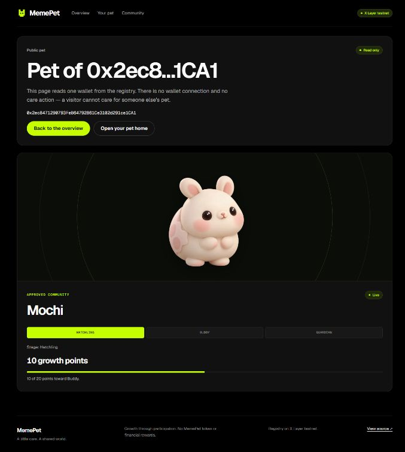

# Final acceptance work — 24 September 2026

Task **FINAL-ACCEPTANCE**. Real Chrome at `https://memepet.vercel.app/pet`,
X Layer testnet **1952**, registry
`0xe844152262D243a7B90F6e07FF7A67F1d7FeD216`, demo account
`0x2ec8471290793FeB64792861Ce3102d291ce1CA1`.

The existing tab was opened before the documentation-only PR #43 rollout.
Its exact loaded bundle SHA was not independently established. The app source
at reviewed baseline `a698ed3` was unchanged by #43/#44. Do not relabel this
session as a browser rerun of a later fix. The final video was **not recorded**.

## Real browser observations

| Check | Observed result | Status / limit |
|---|---|---|
| Fresh connection | Codex clicked Connect; Deston reported approval with no warning; app displayed intended account and chain 1952 | PASS for connection. Warning-free prompt is human-reported, not independently inspected by automation |
| Adoption | Deston said he had just clicked adoption; page already displayed Adopted/Hatchling/0 points when inspected | User-reported action + verified chain receipt below. Awaiting/pending/adoption-success transitions were not observed; no full adoption-flow pass |
| Rejected adoption | The account already had a pet | NOT RUN; requires a fresh prepared account |
| First care | Codex clicked Care for Mochi; real page displayed Awaiting signature and explicitly no awarded progress; Deston approved; page later showed 10 points and Done today | PASS for performed care and observed final read-back; transient pending/hash/success UI was not captured |
| Same-day cooldown | Care unavailable button disabled; availability explicitly Sep 25, 2026, 12:00 AM UTC | PASS; no second write attempted |
| Community immediately after care | Header stayed 0 for more than two minutes while pet showed 10 and chain total was 1 | FAIL on this loaded release; follow-up fix/verification recorded separately below |
| Reload | Same intended account, Hatchling, 10 points, UTC cooldown; header now 1 | PASS for normal reload persistence and refreshed total; a cache-bypassing hard reload was not separately tested |
| Public pet | Real read-only page showed same owner, Mochi, Hatchling and 10 points; no connect/care action | PASS for this pet-bearing public page |
| Account switch | Deston reports no second test account | NOT RUN; no mock promoted to a real pass |
| Later-UTC-day care/evolution | First care was on UTC day 20720 | NOT RUN; next opportunity is 25 September 00:00 UTC / 08:00 Singapore |
| Video capture | Deston could not record this session | NOT RECORDED; screenshot and receipt evidence are not continuous demo footage |

Captured browser warnings were from the MetaMask extension's listener/stream
handling. No application error was captured in that log inspection. This is
not a whole-session guarantee of zero console errors or a security audit.

## Chain evidence — independent read-only verification

No CLI signer, key import, transfer or chain write was used. Viem public-client
calls read the registry, transactions, receipts and events. A historical
`petOf` binary search located the account's first adoption block; its `Adopted`
event and transaction were then checked directly.

| Field | Adoption | Care |
|---|---|---|
| Full transaction hash | `0x665caef1b35eee8ceea49881b320aaf46f6b09f1ff5ebd7a4752b02f7fd9b4fe` | `0x71306dc528a4b15c26c60b3e106e3d01f05bc526d40b07cc55cd9559f2cb5cf4` |
| Block | 41,799,031 | 41,799,228 |
| Block time UTC | 2026-09-24 13:51:08 | 2026-09-24 13:54:25 |
| Receipt | success | success |
| Decoded call | `adopt(1)` | `care()` |
| From / to | Intended demo account / registry above | Same account / registry |
| Native value | 0 | 0 |
| Event | Adopted, owner matches, community 1 | Cared, owner matches, community 1, careCount 1, utcDay 20720 |

Block-pinned comparison:

| | Before care | After care |
|---|---|---|
| Block | 41,799,174 | 41,799,310 |
| Block hash | `0x8180921b932064c49d07649b23dcdf64be4ed879254277989b6cac8a2df30efc` | `0xff78d0daf8061b7d652669863217d9384a2e589b5505440433227788c1f7ba48` |
| Local capture UTC | 2026-09-24 13:53:34 | 2026-09-24 13:55:51 |
| petOf | exists=true, community=1, careCount=0, lastCareDay=0 | exists=true, community=1, careCount=1, lastCareDay=20720 |
| communityStats(1) | 0 | 1 |

`eth_getLogs` covered **(41,799,174, 41,799,310]** in chunks of at most
100 blocks. Exactly one registry `Cared` event was returned: the care above.
Its owner, transaction, successful receipt and +1 delta match. This establishes
attribution for this measured interval, not organic-user metrics or future runs.
The before balance was 399984887879244394 wei; an unsigned care gas estimate
was 52,763 at 20,000,001 wei gas price. These are dated testnet observations.

## Follow-up release verification

The follow-up fix passes the successful care receipt's block to the community
read immediately. While that read runs, the header shows Reading; if it fails,
it shows Unknown. It does not infer `+1`. The pin is cleared when the wallet or
network session changes. Controlled tests reproduced the stale header when an
unpinned latest read lags the receipt; the precise cause of the original
browser observation remains unproven because its RPC response was not captured.

Sixteen focused tests across three files, scoped lint and typecheck passed
before integration. Counter-helper regressions (eight Node tests) also passed
and are now included in CI. The full local application suite passed **115 tests
across 21 files**; full lint passed with one existing share-image warning.
Relative documentation references and whitespace checks passed. Full
current-head CI is required before merge.
Post-fix deployment/browser reads will be recorded separately; a further real
care on the fixed release has **not** been performed.

## Eligibility and rights

Deston reports no organizer confirmation yet. Acceptance, testnet-only track
eligibility, route, exact roster/form declarations and reference-input rights
remain unresolved. Deston confirms creating Mochi in ChatGPT, Kym finalizing
it, and all three members agreeing to submit their contributions. See current
[submission rights](../../SUBMISSION.md#rights) and [art provenance](../../pet-assets.md).
The official, identical Geist/Geist Mono OFL notices were fetched from the
Google Fonts project and preserved at `public/licenses/geist-OFL.txt`; this
does not select a licence for the team's own project.

